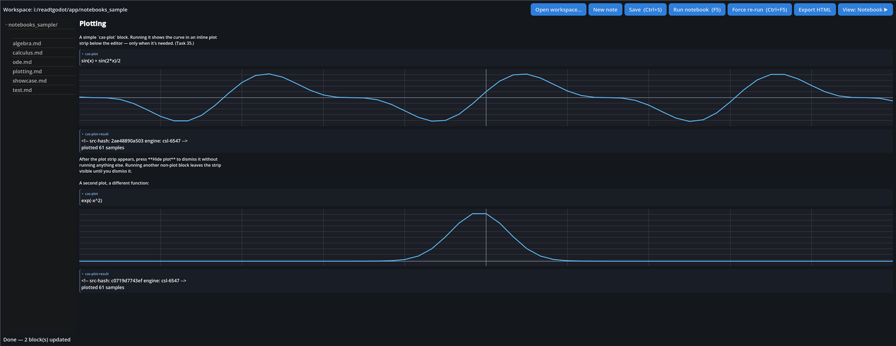

# Symbolic Math Workbench

A Godot-based desktop application that drives a long-lived
**REDUCE Computer Algebra System** subprocess via stdio. Symbolic algebra,
calculus, ODEs, linear algebra, Gröbner bases, etc. — with both a
calculator view and a Mathematica-style notebook view (markdown
notebooks with content-addressed result caching, inline plots, force
re-run, HTML export).

## Quick screenshot

The Mathematica-style notebook view with inline plot rendering
(task 35 v2):



## What's in the repo

| Folder / file                            | What it is                                                |
|------------------------------------------|-----------------------------------------------------------|
| [`app/`](app/)                           | The Godot project (entry point: `app/project.godot`)      |
| [`app/scripts/`](app/scripts/)            | Main GDScript files — UI, runner, formatters, config layers |
| [`app/autoload/math_engine.gd`](app/autoload/math_engine.gd) | Persistent REDUCE child + sentinel-correlated pipe       |
| [`app/notebooks_sample/`](app/notebooks_sample/) | Bundled sample notebooks (algebra, calculus, ODEs, plotting, showcase, task37) |
| [`workdoc/`](workdoc/)                   | Verbatim mirror of REDUCE's worked-problem `.tst` files   |
| `task*.md`                                | Per-task design + implementation docs (60+ tasks)         |

## What's *not* in the repo (and how to get it)

The bundled binaries are excluded — they exceed GitHub's per-file size
limits:

| Path                          | Why excluded               | How to fetch                                                                                  |
|-------------------------------|----------------------------|-----------------------------------------------------------------------------------------------|
| `tools/godot/`                | 164 MB Godot binary         | Download `Godot_v4.6.3-stable_win64.exe` from <https://godotengine.org/download/archive/4.6.3-stable/> |
| `tools/reduce/`               | 253 MB REDUCE install       | Install REDUCE from <https://reduce-algebra.sourceforge.io/> and copy `<install>\packages\` and `<install>\lib\csl\reduce.exe` |

Once both are in `tools/godot/Godot_v4.6.3-stable_win64.exe` and
`tools/reduce/lib/csl/reduce.exe`, the app resolves them relative to the
project automatically.

## Running it

```powershell
# From this repo's root:
& '.\tools\godot\Godot_v4.6.3-stable_win64.exe' --path '.\app'
```

The app opens maximised in the notebook view. Switch between source and
rendered modes with the **Show Source / Show Notebook** button.

Useful shortcuts:

| Key       | What it does                                  |
|-----------|-----------------------------------------------|
| **F1**    | Multi-step help wizard                         |
| **F2**    | Toggle Notebook ↔ Calculator view              |
| **F3**    | Advanced problems tab (332 preset problems)    |
| **F4**    | Engine packages dialog (tick optional packages)|
| **F5**    | Run notebook                                   |
| **Ctrl+F5** | Force re-run (bypass cache)                  |
| **F11**   | Toggle fullscreen                              |
| **Esc**   | Close fullscreen / wizard / advanced view      |

## How it's built — feature highlights

Each numbered task in `todo.txt` produced a doc beside it; the major
arcs:

- **Engine pipeline** — long-lived REDUCE subprocess driven via
  `OS.execute_with_pipe` + sentinel-correlated reader thread.
  ([task6](task6_combined_app_implementation.md), [task24](task24_reset_session_bug.md))
- **Notebook view** — content-addressed cache, force re-run, fence-based
  parsing of `cas` / `cas-test` / `cas-derive` / `cas-plot` blocks.
  ([task19](task19_p0_p2_implementation.md), [task29](task29_force_rerun.md), [task35](task35_inline_plot.md))
- **332-problem advanced library** — sidebar + searchable 3-col grid.
  ([task26](task26_problem_menu.md), [task27](task27_advanced_display.md))
- **Engine package picker** — five-tier dropdown with five Tier-1
  defaults, persisted to `user://packages.cfg`.
  ([task31](task31_default_packages.md), [task32](task32_package_dropdown.md))
- **Font / colour / style customisation** — 23 fonts × 5 themes × 3
  density presets, all persisted across launches.
  ([tasks 58–63](task58_notebook_primary_and_fonts.md))
- **Comprehensive UI regression test** — 66/66 PASS in 4.4 s across 13
  phases. ([task25](task25_comprehensive_ui_test.md),
  [task36](task36_comprehensive_test_v2.md))

## Per-task docs

There's a `task*.md` per task in the repo root — search for `task<N>_`
to find a specific one. They include screenshots, motivation, what's in
scope, and what's intentionally deferred.

## Licence

The app's own source code (`app/scripts/`, `app/autoload/`,
`app/scenes/`, the `task*.md` docs) is the author's work.

The contents of `workdoc/` are a verbatim mirror of REDUCE's
worked-problem `.tst` files; REDUCE's BSD-style licence applies to
them.

REDUCE and Godot themselves (downloaded separately, see above) carry
their own licences.
